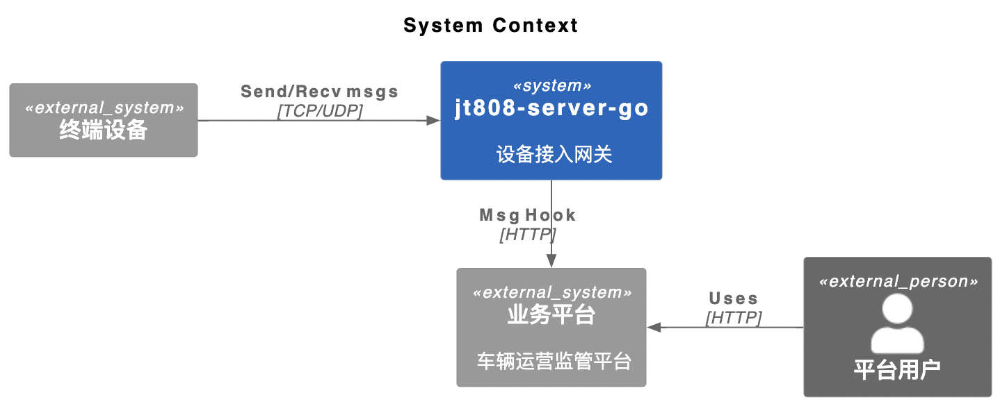
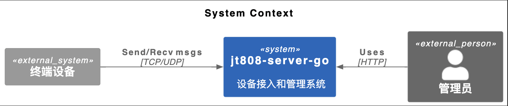
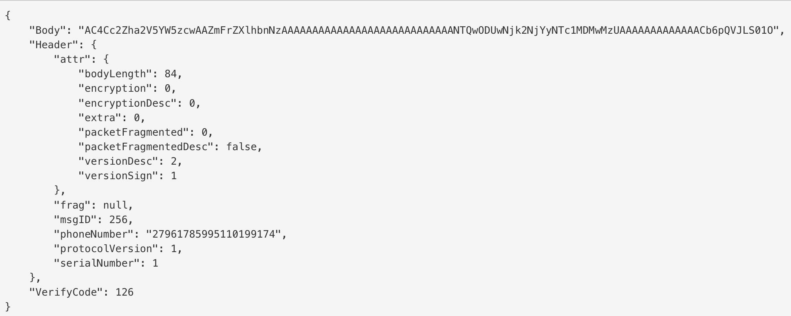
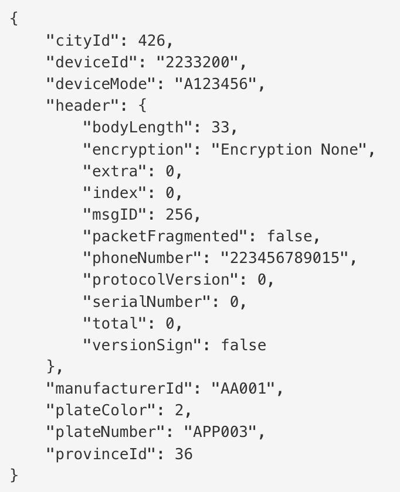
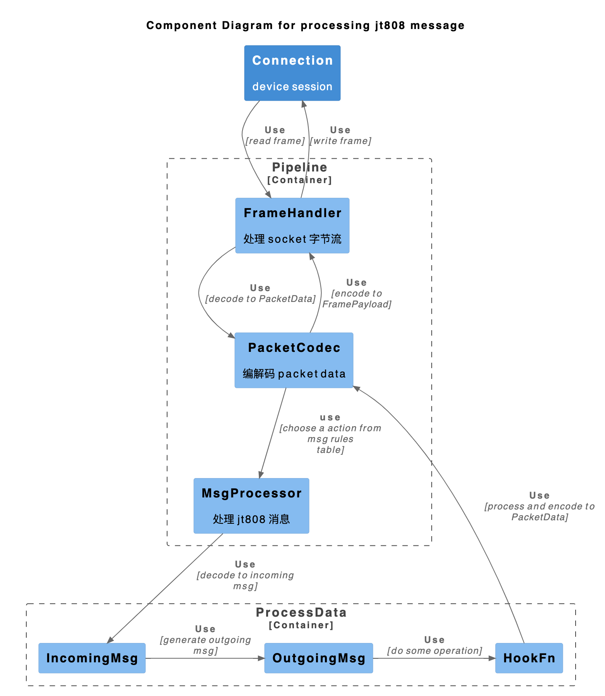
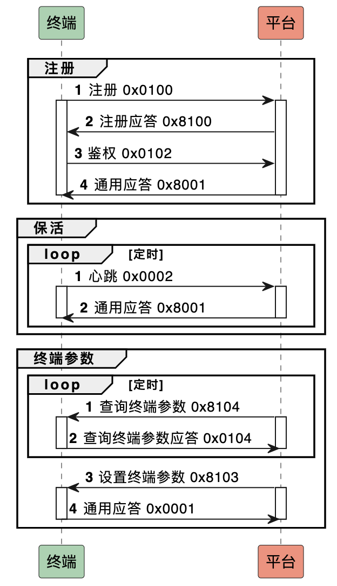
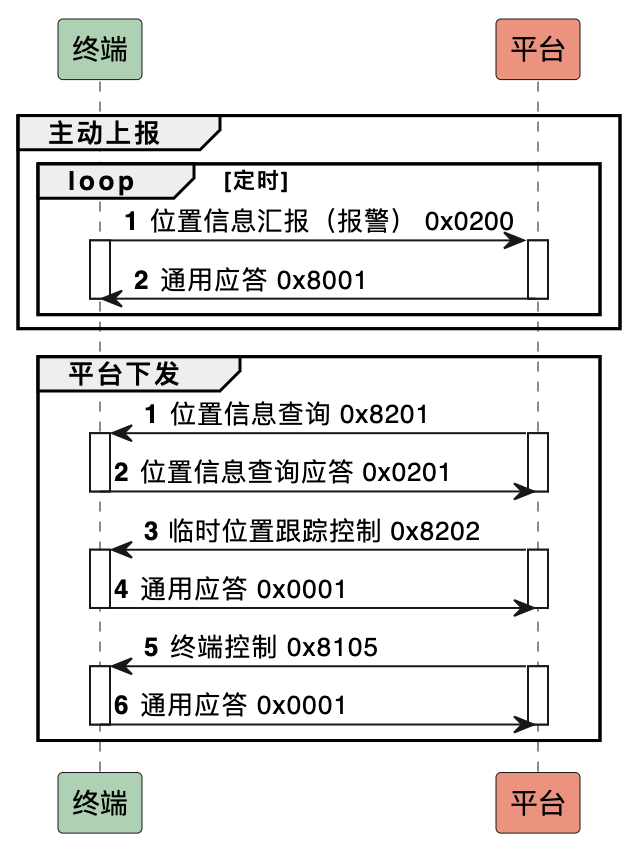
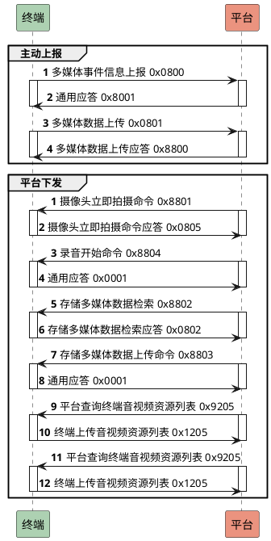

# jt808-server-go

实现 TCP 消息处理逻辑，实现双向通信。

## 项目背景

这个项目实现之前，我在 github 比较了 5+ 个同类项目，它们有一些不同的实现。以 Java 语言的举例，基本是基于 Netty 包实现的数据读取和 JT808 的协议封装，并依赖 Spring 提供一个 Web 操作入口。从我的角度来看，这些实现不能说做的不好，单从性能指标来讲甚至很突出，但是在代码可读性上一定是做的不够的。我猜测这可能囿于 Java 本身的设计模式，或者是模仿 Spring 切面编程实现的各种注解/拦截器，看起来是很美好，但是在代码可读性上带来了更多的困难。

这个项目创建初衷，主要有这几点：
- 作为我的 golang 项目实践，真正的考虑实际业务场景，让我更熟悉 golang 的编程模式
- 我之前主要做 Web 应用开发，希望借此熟悉更底层的 socket 编程
- 给需要对接 JT808 协议的开发者提供一个简明参考，**如果你觉得有帮助，请给一个 star 和 fork 吧**

以此，jt808-server-go 的**设计原则**只有一点：**简洁可读**。

## 项目特点

### 兼容 JT808 2019/2013/2011 版本差异

定义版本类型分为 `Version2019 / Version2013 / Version2011`。

由于通过消息头无法区分 2011 和 2013 版本，所以这部分存在硬编码，通过消息长度和字段长度来判断。

目前已知 2011/2013/2019 版本的区别：
| 区别点             | 2011    | 2023    | 2019    |
| ------------------ | ------- | ------- | ------- |
| 终端制造商编码长度 | 5 字节  | 5 字节  | 11 字节 |
| 终端型号编码长度   | 8 字节  | 20 字节 | 30 字节 |
| 终端 ID 编码长度   | 7 字节  | 7 字节  | 30 字节 |
| 从业资格证编码长度 | 40 字节 | 20 字节 | 20 字节 |

### 支持 JT1078 协议的音视频传输控制

### 支持常见消息列表 (WIP)

| 终端侧                    | 平台侧                    |
| ------------------------- | ------------------------- |
| 0x0001 终端通用应答       | 0x8001 平台通用应答       |
| 0x0002 终端心跳           | 0x8004 查询服务器时间应答 |
| 0x0003 终端注销           | 0x8100 终端注册应答       |
| 0x0004 查询服务器时间请求 | 0x8103 设置终端参数       |
| 0x0100 终端注册           | 0x8104 查询终端参数       |
| 0x0102 终端鉴权           |                           |
| 0x0104 查询终端参数应答   |                           |
| 0x0200 位置信息汇报       |                           |

### 支持 Gateway 模式和 Standalone 模式 (WIP)

默认 **Gateway** 模式，jt808-server 只作为终端设备接入层，提供协议解析能力，仅缓存设备信息用于信令控制。
可实现 Action 接口对特定消息进行 Hook 操作，方便对接第三方业务平台。

也支持 **Standalone** 模式，jt808-server 持久化存储设备数据，并提供设备、车辆等运维管理 HTTP API。

### 808 终端设备模拟器

为了方便测试，实现了一个 JT808 终端设备的模拟器，可以通过配置化的方式，支持对平台进行功能测试和性能测试。

## 系统设计

jt808-server-go 可以作为设备接入网关 (Gateway 模式），解析和回复协议消息，并在特定的消息处理中，回调第三方业务平台，满足业务平台的车辆运营监管功能需求。



<!--
```plantuml
@startuml
!include https://raw.githubusercontent.com/plantuml-stdlib/C4-PlantUML/master/C4_Context.puml

LAYOUT_LANDSCAPE()

title System Context

System_Ext(device, "终端设备")
Person_Ext(admin, "平台用户")
System(jt808serv, "jt808-server-go", "设备接入网关")
System_Ext(webapp, "业务平台", "车辆运营监管平台")

Rel_Right(device, jt808serv, "Send/Recv msgs", "TCP/UDP")
Rel_Left(admin, webapp, "Uses", "HTTP")
Rel_Neighbor(jt808serv, webapp, "Msg Hook", "HTTP")
@enduml
```
-->

jt808-server-go 也可以作为设备接入和管理系统进行一体化部署（Standalone 模式），提供基础的设备接入和管理能力。



<!--
```plantuml
@startuml
!include https://raw.githubusercontent.com/plantuml-stdlib/C4-PlantUML/master/C4_Context.puml

LAYOUT_LANDSCAPE()

title System Context

System_Ext(device, "终端设备")
Person_Ext(admin, "管理员")
System(jt808serv, "jt808-server-go", "设备接入和管理系统")

Rel_Right(device, jt808serv, "Send/Recv msgs", "TCP/UDP")
Rel_Left(admin, jt808serv, "Uses", "HTTP")
@enduml
```
-->

### 平台与终端的连接处理

依据 2019 版协议文档，需要对设备鉴权标记状态，并根据心跳消息进行设备保活处理。jt808-server-go 在这里引入了 gron 库，将每个终端连接的保活检查抽象为一个 KeepaliveCheckJob，依赖一个协程来处理所有的 Job，判断终端的状态，如果心跳未续期，则断开连接并清理相关数据。

> **连接的建立：**   
> 终端与平台的数据日常连接可采用 TCP 或 UDP 方式，终端复位后应尽快与平台建立连 接，连接建立后立即向平台发送终端鉴权消息进行鉴权。  
> **连接的维持：**   
> 连接建立和终端鉴权成功后，在没有正常数据包传输的情况下，终端应周期性向平台发 送终端心跳消息，平台收到后向终端发送平台通用应答消息，发送周期由终端参数指定。  
> **连接的断开：**  
> 平台和终端均可根据 TCP 协议主动断开连接，双方都应主动判断 TCP 连接是否断开。  
> 平台判断 TCP 连接断开的方法：
> - 根据 TCP 协议判断出终端主动断开；
> - 相同身份的终端建立新连接，表明原连接已断开；
> - 在一定的时间内未收到终端发出的消息，如终端心跳。  
>
> 终端判断 TCP 连接断开的方法：
> - 根据 TCP 协议判断出平台主动断开；
> - 数据通信链路断开；
> - 数据通信链路正常，达到重传次数后仍未收到应答。

### 协议层消息处理主体逻辑

jt808-server-go 在消息处理过程中，做了层次化的设计。我们主要关注下面 3 个关键的结构体。
| 结构体       | 定义                                                                                                            | 示例                                                                                                                                                                   |
| ------------ | --------------------------------------------------------------------------------------------------------------- | ---------------------------------------------------------------------------------------------------------------------------------------------------------------------- |
| FramePayload | 设备建立连接后，接收和发送的消息内容，也就是一串字节数组                                                        | `7E 02 00 00 26 12 34 56 78 90 12 00 7D 02 00 00 00 01 00 00 00 02 00 BA 7F 0E 07 E4 F1 1C 00 28 00 3C 00 00 18 10 15 10 10 10 01 04 00 00 00 64 02 02 00 7D 01 13 7E` |
| PacketData   | 在 read frame 之后，或 write frame 之前，会得到一个关联的 Packet 数据                                           |                                                                                   |
| JT808Msg     | 在 decode packet 之后，或 encode packet 之前，会得到一个关联的 JT808Msg 数据，数据流向分为 incoming 和 outgoing |                                                                                         |

因为这一段数据的编解码中，可能出错的环节特别多，为了尽可能避免 golang 中臭名昭著的 `if err != nil` 处理，jt808-ser-go 中将这些处理过程封装为了一个 pipeline，将每个子过程声明为一个函数类型，通过延迟调用和 breakOnErr 减少错误判断代码。具体实现可看 [`pipeline.go`](internal/protocol/pipeline.go)。



<!-- ```plantuml
@startuml
!include https://raw.githubusercontent.com/plantuml-stdlib/C4-PlantUML/master/C4_Component.puml
LAYOUT_TOP_DOWN()
HIDE_STEREOTYPE()
title Component Diagram for processing jt808 message

Container(conn, "Connection", "", "device session")
Container_Boundary(ProcessData, "ProcessData") {
  Component(in, "IncomingMsg", "", "")
  Component(out, "OutgoingMsg", "", "")
  Component(hook, "HookFn", "", "")
}

Container_Boundary(Pipeline, "Pipeline") {
  Component(fh, "FrameHandler", "", "处理 socket 字节流")
  Component(pc, "PacketCodec", "", "编解码 packet data")
  Component(mp, "MsgProcessor", "", "处理 jt808 消息")
}

Rel_Down(conn, fh, "Use", "read frame")
Rel_Down(fh, pc, "Use","decode to PacketData")
Rel_Down(pc, mp, "use", "choose a action from msg rules table")
Rel_Down(mp, in, "Use", "decode to incoming msg")
Rel_Right(in, out, "Use", "generate outgoing msg")
Rel_Right(out, hook, "Use", "do some operation")
Rel_Up(hook, pc, "Use", "process and encode to PacketData")
Rel_Up(pc, fh, "Use", "encode to FramePayload")
Rel_Up(fh, conn, "Use", "write frame")
@enduml
``` -->
参照上图，在建立 TCP 连接后，一个完整的接收消息和回复消息的过程如下：
1. FrameHandler 调用 socket read，读取终端送达的字节流，在这里称作 FramePayload
2. PacketCodec 将 FramePayload 解码成 PacketData
3. MsgProcessor 处理 PacketData，转换为 incoming msg 
4. MsgProcessor 处理 incoming msg，生成 outgoing msg，调用特定的处理方法，并转为待回复的 PacketData
5. PacketCodec 将 PacketData 编码成 FramePayload
6. FrameHandler 调用 socket write，将 FramePayload 发送给终端

## 平台与终端的消息时序

### 终端管理类协议



<!-- ```plantuml
@startuml

skinparam sequenceMessageAlign left
participant "终端" as c #ADD1B2
participant "平台" as s #EB937F

group 注册
  autonumber 1
  c -> s: 注册 0x0100
  activate c
  activate s
  s -> c: 注册应答 0x8100
  c -> s: 鉴权 0x0102
  s -> c: 通用应答 0x8001
  deactivate s
  deactivate c
end

group 保活
  autonumber 1
  loop 定时
    c -> s: 心跳 0x0002
    activate c
    activate s
    s -> c: 通用应答 0x8001
    deactivate c
    deactivate s
  end
end

group 终端参数
  autonumber 1
  loop 定时
    s -> c: 查询终端参数 0x8104
    activate s
    activate c
    c -> s: 查询终端参数应答 0x0104
    deactivate s
    deactivate c
  end

    s -> c: 设置终端参数 0x8103
    activate s
    activate c
    c -> s: 通用应答 0x0001
    deactivate s
    deactivate c
end

@enduml
``` -->

### 位置/报警类协议



<!-- ```plantuml
@startuml

skinparam sequenceMessageAlign left
participant "终端" as c #ADD1B2
participant "平台" as s #EB937F

group 主动上报
  autonumber 1
  loop 定时
    c -> s: 位置信息汇报（报警） 0x0200
    activate c
    activate s
    s -> c: 通用应答 0x8001
    deactivate s
    deactivate c
    end
end

group 平台下发
  autonumber 1
  s -> c: 位置信息查询 0x8201
  activate s
  activate c
  c -> s: 位置信息查询应答 0x0201
  deactivate c
  deactivate s

  s -> c: 临时位置跟踪控制 0x8202
  activate s
  activate c
  c -> s: 通用应答 0x0001
  deactivate c
  deactivate s

  s -> c: 终端控制 0x8105
  activate s
  activate c
  c -> s: 通用应答 0x0001
  deactivate c
  deactivate s
end

@enduml
``` -->

### 信息类协议
todo

### 电话类协议
todo

### 车辆相关协议
todo

### 多媒体协议


在早些时候，查询多媒体资源列表会通过 JT808 协议的信令交互。后来在实际应用中发现，视频和音频的传输会长时间占用连接通道，这期间其他的操作啥也干不了，只能等着音视频数据传输完。这样不太好，所以推出了 JT1078 协议，此后在 JT808 协议交互中最多进行图片资源的传输，而音视频的传输则通过 JT1078 中的信令消息。

详细来说，就是在 JT1078 中特别指定了 0x0800/0x0801/0x8802/0x0802/0x8803 这 5 条信令消息中多媒体字段只应包含图片类型。



## 编译和运行

需要本地有 go 1.19+环境。

### 构建 jt808-server-go

编译本地版本：
```sh
make compile 

# 产出在 target/debug:
# jt808-server-go
```

交叉编译：

```sh
make release

# 产出在 target/releases：
# jt808-server-go_darwin_amd64
# jt808-server-go_darwin_arm64
# jt808-server-go_linux_amd64
# jt808-server-go_linux_arm64
```

### 运行 jt808-server-go

编译可执行文件运行：
```sh
./jt808-server-go -c "your config file"
```
默认读取 `jt808-server-go` 同级目录的 `configs/default.yaml` 。

源码运行：
```sh
make run
```
**支持自定义 banner, 修改 configs/banner.txt 即可。**

### 构建 jt808-client-go

编译本地版本：
```sh
make compile-client

# 产出在 target/debug:
# jt808-client-go
```

交叉编译：

```sh
make release-client

# 产出在 target/releases：
# jt808-client-go_darwin_amd64
# jt808-client-go_darwin_arm64
# jt808-client-go_linux_amd64
# jt808-client-go_linux_arm64
```

### 运行 jt808-client-go
编译可执行文件运行：
```sh
./jt808-client-go -c "your config file"
```
默认读取 `jt808-client-go` 同级目录的 `configs/default.yaml` ，可自定义终端的配置：

```yaml
......

client:
  name: "jt808-client-go"
  concurrency: 10 # client 并行模拟的终端个数
  conn:
    remoteAddr: "localhost:8080" # server addr
  device:
    idReg: "[0-9]{20}" # 设备 ID 正则生成规则，下列 xxxReg 配置同理
    imeiReg: "[0-9]{15}"
    phoneReg: "[0-9]{20}"
    plateReg: "京 A[A-Z0-9]{5}"
    protocolVersion: "2019" # 协议版本
    transProto: "TCP" # 协议类型，现仅支持 TCP
    keepalive: 20 # 保活周期，单位 s
    provinceIdReg: "[0-9]{2}"
    cityIdReg: "[0-9]{4}"
    plateColorReg: "[0123459]{1}"
  deviceGeo:
    locationReportInterval: 10 # 0200 消息上报间隔，单位 s
    geo:
      accStatusReg: "0|1"
      locationStatusReg: "0|1"
      latitudeTypeReg: "0|1"
      longitudeTypeReg: "0|1"
      operatingStatusReg: "0|1"
      geoEncryptionStatusReg: "0|1"
      loadStatusReg: "0|1"
      FuelSystemStatusReg: "0|1"
      AlternatorSystemStatusReg: "0|1"
      DoorLockedStatusReg: "0|1"
      frontDoorStatusReg: "0|1"
      midDoorStatusReg: "0|1"
      backDoorStatusReg: "0|1"
      driverDoorStatusReg: "0|1"
      customDoorStatusReg: "0|1"
      gpsLocationStatusReg: "0|1"
      beidouLocationStatusReg: "0|1"
      glonassLocationStatusReg: "0|1"
      galileoLocationStatusReg: "0|1"
      drivingStatusReg: "0|1"
    location:
      latitudeReg: "[0-8][0-9]|90"
      longitudeReg: "[0-9]{2}|1[0-7][0-9]|180"
      altitudeReg: "[0-9]{4}"
    drive:
      speedReg: "[0-9]{2}"
      directionReg: "[0-9]{2}|[1-2][0-9]{2}|3[0-5][0-9]"

......
```

源码运行：
```sh
make run-client
```

## WIP

- msg header 中描述版本信息的字段有好几个，可以精简使用
- 存在一些没必要的 oo 的设计，比如获取缓存，直接通过 id 查询就可以，不需要先获取一个缓存对象，再从里查询缓存。另外为方便管理 session，需要将其抽出到缓存层
- 调研 go struct tag，用以简化 msg decode&encode 代码
- 单测覆盖率提升
- 封装统一处理结果，包含 result 和 error 定义，再有连接控制层进行处理
- 当前设计的 Pipeline 同步处理逻辑耦合性还是比较高，想一想，利用 channel 传输数据，每一层只关注 channel 的数据接收、处理和写入
