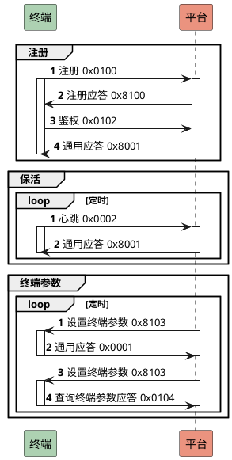
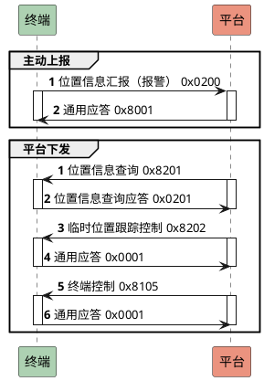
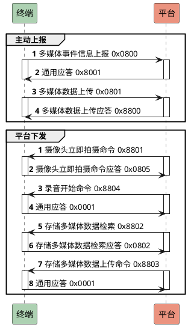

# jt808-server-go

实现 TCP 消息处理逻辑，实现双向通信。

## 项目背景

这个项目实现之前，我在 github 比较了 5 个同类项目，有一些不同的实现。以 Java 语言的举例，基本是基于 Netty 包实现的数据读取和 JTT808 的协议封装，并依赖 Spring 提供一个 Web 操作入口。从我的角度来看，这些项目不能说做的不好，单从性能指标来讲甚至很突出，但是在代码可读性上一定是做的不够的。我猜测这可能囿于 Java 本身的设计模式，或者是模仿 Spring 切面编程实现的各种注解/拦截器，看起来是很美好，但是在代码可读性上带来了更多的困难。

这个项目创建初衷，主要有这几点：
- 作为我的 golang 项目实践，真正的考虑实际业务场景，让我更熟悉 golang 的编程模式
- 我之前主要做 Web 开发，希望借此熟悉更底层 socket 编程
- 给需要对接 JTT808 协议的开发者提供一个简明参考，**如果你觉得有帮助，请给一个 star 和 fork 吧**

以此，jt808-server-go 的**设计原则**只有两点：
- 逻辑简洁
- 代码易读

## 项目设计

1. FrameHandler 调用 TCP read，读取终端送达的字节流，在这里称作 FramePayload
2. PacketCodec 将 FramePayload 解码成 PacketData
3. MsgHandler 处理 PacketData，转换为 JT808Msg
4. MsgHandler 处理 JT808Msg，生成响应消息 JT808Msg，转为 PacketData
5. PacketCodec 将 PacketData 编码成 FramePayload
6. FrameHandler 调用 TCP write，将 FramePayload 发送给终端

核心框架：
- [x] TCP 双向通信基础逻辑实现
- [x] codec 层实现

### 平台与终端的连接处理

### 平台与终端的交互流程

#### 终端管理类协议

#### 位置/报警类协议

#### 信息类协议
todo

#### 电话类协议
todo

#### 车辆相关协议
todo

#### 多媒体协议

## 支持的功能

  - 兼容 2019/2013 版本差异

### 支持的消息列表
| 终端侧                    | 平台侧                    |
| ------------------------- | ------------------------- |
| 0x0001 终端通用应答       | 0x8001 平台通用应答       |
| 0x0002 终端心跳           | 0x8004 查询服务器时间应答 |
| 0x0003 终端注销           | 0x8100 终端注册应答       |
| 0x0004 查询服务器时间请求 |                           |
| 0x0100 终端注册           |                           |
| 0x0102 终端鉴权           |                           |
| 0x0200 位置信息汇报       |                           |

## Todo

- 单测
- 控制面逻辑
  - 注册后存储 session，注销后删除 session，心跳保活 session
  - 封装统一处理结果，包含 result 和 error 定义，再有连接控制层进行处理
- 数据持久化
  - 默认仅缓存，不开启持久化
    - 缓存参考 gcache，对每个 session 定时过期
  - 预留持久化接口，支持 mysql 存储、http api 调用

定义版本类型分为 Version2019 和 Version2013.

由于无法区分 2011 和 2013 版本，所以这部分存在硬编码，通过消息长度和字段长度来判断。

目前已知 2011/2013/2019 版本的区别：

制造商 ID
- 2013 版本 5 个字节，终端制造商编码
- 2019 版本 11 个字节，终端制造商编码

终端型号
- 2011 版本   8 个字节  ，此终端型号由制造商自行定义，位数不足时，后补“0X00”
- 2013 版本   20 个字节，此终端型号由制造商自行定义，位数不足时，后补“0X00”。
- 2019 版本   30 个字节，此终端型号由制造商自行定义，位数不足时，后补“0X00”。

终端 ID
- 2013 版本  7 个字节，由大写字母和数字组成，此终端 ID 由制造商自行定义，位数不足时，后补“0X00”。
- 2019 版本  30 个字节，由大写字母和数字组成，此终端 ID 由制造商自行定义，位数不足时，后补“0X00”。

从业资格证编码 
- 2011 长度 40 位 ，不足补 '\0'；
- 2013 长度 20 位，不足补 '\0'。

重传包总数
- 2013 byte
- 2019 ushort

2019 版本已作删除消息
- 事件报告 0x0301
- 提问应答 0x0302
- 信息点播/取消 0x0303
- 事件设置 0x8301
- 提问下发 0x8302
- 信息服务 0x8304
