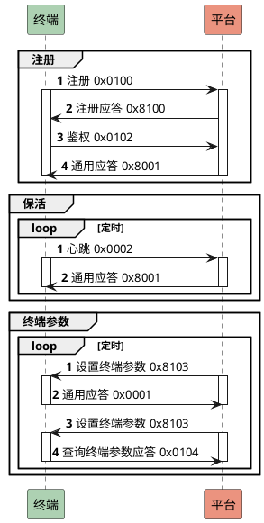
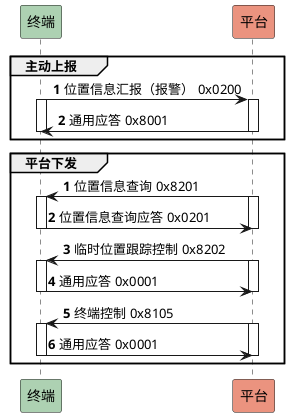
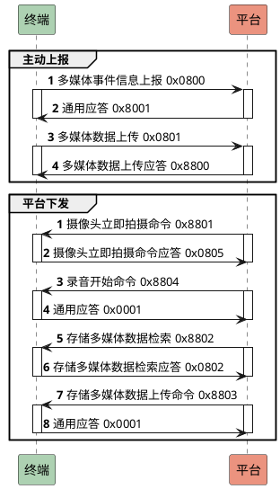

# jt808-server-go

实现 TCP 消息处理逻辑，实现双向通信。

## 项目背景

这个项目实现之前，我在 github 比较了 5+ 个同类项目，它们有一些不同的实现。以 Java 语言的举例，基本是基于 Netty 包实现的数据读取和 JTT808 的协议封装，并依赖 Spring 提供一个 Web 操作入口。从我的角度来看，这些实现不能说做的不好，单从性能指标来讲甚至很突出，但是在代码可读性上一定是做的不够的。我猜测这可能囿于 Java 本身的设计模式，或者是模仿 Spring 切面编程实现的各种注解/拦截器，看起来是很美好，但是在代码可读性上带来了更多的困难。

这个项目创建初衷，主要有这几点：
- 作为我的 golang 项目实践，真正的考虑实际业务场景，让我更熟悉 golang 的编程模式
- 我之前主要做 Web 应用开发，希望借此熟悉更底层的 socket 编程
- 给需要对接 JT808 协议的开发者提供一个简明参考，**如果你觉得有帮助，请给一个 star 和 fork 吧**

以此，jt808-server-go 的**设计原则**只有一点：**简洁可读**。

## 项目特点

### 兼容 2019/2013/2011 版本差异

定义版本类型分为 `Version2019 / Version2013 / Version2011`。

由于通过消息头无法区分 2011 和 2013 版本，所以这部分存在硬编码，通过消息长度和字段长度来判断。

目前已知 2011/2013/2019 版本的区别：
| 区别点             | 2011    | 2023    | 2019    |
| ------------------ | ------- | ------- | ------- |
| 终端制造商编码长度 | 5 字节  | 5 字节  | 11 字节 |
| 终端型号编码长度   | 8 字节  | 20 字节 | 30 字节 |
| 终端 ID 编码长度   | 7 字节  | 7 字节  | 30 字节 |
| 从业资格证编码长度 | 40 字节 | 20 字节 | 20 字节 |

### 支持常见消息列表 (WIP)

| 终端侧                    | 平台侧                    |
| ------------------------- | ------------------------- |
| 0x0001 终端通用应答       | 0x8001 平台通用应答       |
| 0x0002 终端心跳           | 0x8004 查询服务器时间应答 |
| 0x0003 终端注销           | 0x8100 终端注册应答       |
| 0x0004 查询服务器时间请求 |                           |
| 0x0100 终端注册           |                           |
| 0x0102 终端鉴权           |                           |
| 0x0200 位置信息汇报       |                           |

### 支持 Gateway 模式和 Standalone 模式 (WIP)

默认 **Gateway** 模式，jt808-server 只作为终端设备接入层，提供协议解析能力，仅缓存设备信息用于信令控制。
可实现 Action 接口对特定消息进行 Hook 操作，方便对接第三方业务平台。

也支持 **Standalone** 模式，jt808-server 持久化存储设备数据，并提供设备、车辆等运维管理 HTTP API。

### 808 终端设备模拟器

为了方便测试，实现了一个 JT808 终端设备的模拟器，可以通过配置化的方式，支持对平台进行功能测试和性能测试。

## 系统设计

jt808-server-go 可以作为设备接入网关 (Gateway 模式），解析和回复协议消息，并在特定的消息处理中，回调第三方业务平台，满足业务平台的车辆运营监管功能需求。


<!--
```plantuml
@startuml
!include https://raw.githubusercontent.com/plantuml-stdlib/C4-PlantUML/master/C4_Context.puml

LAYOUT_LANDSCAPE()

title System Context

System_Ext(device, "终端设备")
Person_Ext(admin, "平台用户")
System(jt808serv, "jt808-server-go", "设备接入网关")
System_Ext(webapp, "业务平台", "车辆运营监管平台")

Rel_Right(device, jt808serv, "Send/Recv msgs", "TCP/UDP")
Rel_Left(admin, webapp, "Uses", "HTTP")
Rel_Neighbor(jt808serv, webapp, "Msg Hook", "HTTP")
@enduml
```
-->

jt808-server-go 也可以作为设备接入和管理系统进行一体化部署（Standalone 模式），提供基础的设备接入和管理能力。


<!--
```plantuml
@startuml
!include https://raw.githubusercontent.com/plantuml-stdlib/C4-PlantUML/master/C4_Context.puml

LAYOUT_LANDSCAPE()

title System Context

System_Ext(device, "终端设备")
Person_Ext(admin, "管理员")
System(jt808serv, "jt808-server-go", "设备接入和管理系统")

Rel_Right(device, jt808serv, "Send/Recv msgs", "TCP/UDP")
Rel_Left(admin, jt808serv, "Uses", "HTTP")
@enduml
```
-->

### 平台与终端的连接处理

依据 2019 版协议文档，需要对设备鉴权标记状态，并根据心跳消息进行设备保活处理。


### 协议层消息处理主体逻辑

在建立 TCP 连接后，需要按顺序进行以下处理：
1. FrameHandler 调用 socket read，读取终端送达的字节流，在这里称作 FramePayload
2. PacketCodec 将 FramePayload 解码成 PacketData
3. MsgProcessor 处理 PacketData，转换为 incoming msg 
4. MsgProcessor 处理 incoming msg，生成 outgoing msg，转为待回复的 PacketData
5. PacketCodec 将 PacketData 编码成 FramePayload
6. FrameHandler 调用 socket write，将 FramePayload 发送给终端


为了尽可能避免 golang 中臭名昭著的 `if err != nil` 处理，将这些处理过程封装为了一个 pipeline，将每个子过程声明为一个函数类型，通过延迟调用和 breakOnErr 减少错误判断代码。具体实现可看 [`pipeline.go`](internal/protocol/pipeline.go)

## 平台与终端的消息时序

### 终端管理类协议

<!--

-->

### 位置/报警类协议


<!--

-->

### 信息类协议
todo

### 电话类协议
todo

### 车辆相关协议
todo

### 多媒体协议

<!--

-->

## 其他 Todo

- 单测覆盖率提升
- 封装统一处理结果，包含 result 和 error 定义，再有连接控制层进行处理
- 调研 go struct tag，用以简化 msg decode&encode 代码
- 当前设计的 Pipeline 同步处理逻辑耦合性还是比较高，想一想，利用 channel 传输数据，每一层只关注 channel 的数据接收、处理和写入。